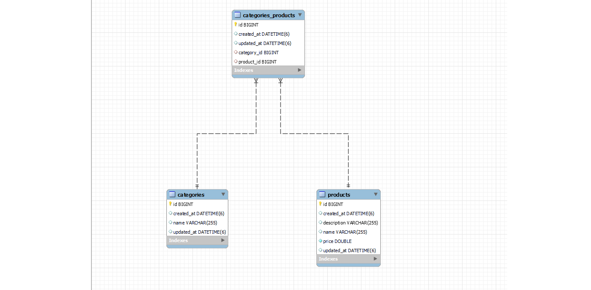
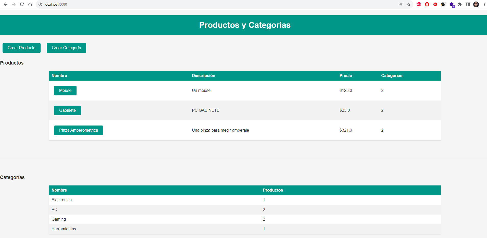
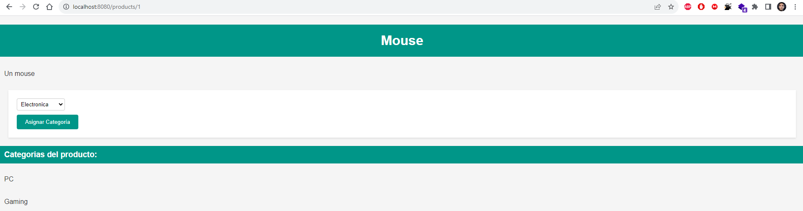
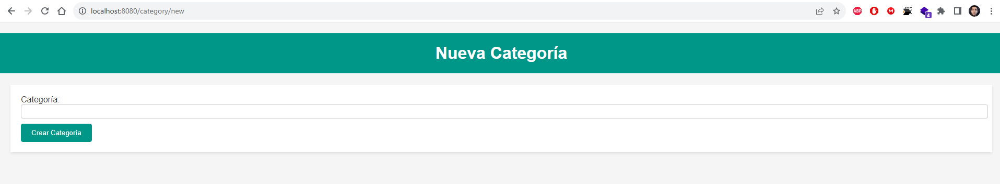

# APP monolítica Productos y Categorias - Coding Dojo Spring Data II

### Dos tablas que se relacionan de manera "Muchos a Muchos" por ende dan un resultado de 3 tablas

Se crean productos y categorías por separado y luego se les asigna categorías a los productos.

### Características

- Relación entre dos tablas en la base de datos SQL.
- Realizado con MVC con Thymeleaf.

  
  
  
  

